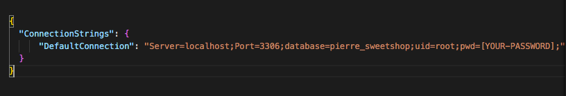
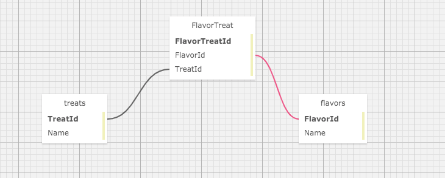

### _This project is not in a complete or portfolio ready state, and should not be considered representiational of professional work._

# Pierre's Sweet And Savory Treats

### Epicodus Independent Code Review - Authentication With Identity

### By Collin Chapman

## Technologies Used

* Git
* C#
* .NET 5.0
* ASP.NET Core
* Entity Framework Core
* Razor View Engine
* MVC
* RESTful Routing, CRUD & HTTP
* REPL
* MySQL & MySQL Workbench
* Bootstrap
* CSS
* Identity

## Description

This is a C# MVC web application built with Identity to allow user authentication, that way only logged in users, such as Pierre himself, can create, update and delete items from the website. 

## Setup/Installation Requirements

* _Requires Visual Studio Code Installation_
* _Requires Terminal Installation_
* _Open the terminal on your local machine_
* _Navigate to the directory inside of which you wish to house this project_
* _Clone this project with the following command  `$ git clone <https://github.com/colchapm/SweetAndSavory.Solution.git>`_
* _Next you will need to download and install .NET Core through this link if you don't already have it: https://dotnet.microsoft.com/download_
* _After downloading and installing .NET Core, return to your terminal and navigate to the root directory by entering `$ cd SweetAndSavory.Solution`_
* _Open this project in Visual Studio Code with the command `$ code .`_
* _Still in the terminal, navigate to the desired subdirectory of the repository with the command `$ cd SweetAndSavory`_
* _Retrieve and install packages listed in the .csproj files with the command `$ dotnet restore`_
* _Create internal content for build with the command `$ dotnet build`_
* _In Visual Studio Code, navigate to the `SweetAndSavory` directory and create an **appsettings.json** file and input the following script (**note the name of the database can be whatever you would like (e.g. pierre_sweetshop)**)_

* _If you do not have MySQL Workbench, it can be downloaded here: https://dev.mysql.com/downloads/file/?id=484391_
* _Create Initial SQL migration with the following command `$ dotnet ef migrations add Initial`_
* _Update the database in MySQL Workbench with the following command `$ dotnet ef database update` (**note this will title the database whatever you listed in your appsettings.json file (e.g. pierre_sweetshop_test)**) _
* _Back in the terminal, navigate to `$ cd SweetAndSavory` and run the application with the command `$ dotnet run`

## Diagram of the Many-To-Many relationship used in this project

## User Stories 

| Functionalities | 
|:---: |
| The application should have user authentication. A user should be able to log in and log out. Only logged in users should have create, update and delete functionality. All users should be able to have read functionality. | 
| There should be a many-to-many relationship between Treats and Flavors. A treat can have many flavors (such as sweet, savory, spicy, or creamy) and a flavor can have many treats. For instance, the "sweet" flavor could include chocolate croissants, cheesecake, and so on. | 
| A user should be able to navigate to a splash page that lists all treats and flavors. Users should be able to click on an individual treat or flavor to see all the treats/flavors that belong to it. | 

## Known Bugs

No known bugs at this time

## Link

This project is not hosted on GitHub Pages

## License

Copyright (c) 2021 Collin Chapman

This software is licensed under the MIT license

## Contact Information

cchap14@gmail.com
